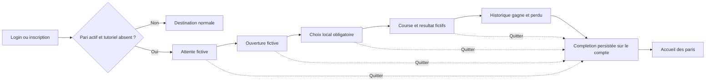

# Architecture Logicielle

## Vision Generale

L'application est construite par vertical slicing : chaque lot ajoute une capacite metier exploitable et testable. Les couches doivent rester simples et explicites.

Architecture backend actuelle :

```text
Controller REST
-> Service applicatif
-> Repository Spring Data JPA
-> Entites JPA
```

La securite HTTP est centralisee dans `security.SecurityConfig`. La generation JWT est centralisee dans `security.JwtService`.

## Packages Actuels

```text
com.pixsom.racebets
com.pixsom.racebets.admin
com.pixsom.racebets.admin.horse
com.pixsom.racebets.admin.horse.dto
com.pixsom.racebets.admin.race
com.pixsom.racebets.admin.race.dto
com.pixsom.racebets.admin.raceentry
com.pixsom.racebets.admin.raceentry.dto
com.pixsom.racebets.auth
com.pixsom.racebets.auth.dto
com.pixsom.racebets.config
com.pixsom.racebets.security
com.pixsom.racebets.repositories
com.pixsom.racebets.entities
com.pixsom.racebets.entities.common
com.pixsom.racebets.enums
```

## Modele Domaine Valide

### AppUser

Entite utilisateur applicatif.

Table : `app_user`.

Points importants :

- Le nom Java est singulier et evite la collision avec `org.springframework.security.core.userdetails.User`.
- Les roles sont stockes en `@ElementCollection` avec `EnumType.STRING`.
- Le secret d'acces est stocke sous forme de `passwordHash`, jamais en clair.
- L'authentification actuelle utilise `email + accessCode`, avec verification BCrypt.

### Race

Entite course.

Table : `races`.

Ne doit pas contenir directement `winnerHorseId`. Le resultat appartient a la participation, pas a la course seule.

### Horse

Entite cheval.

Table : `horses`.

Le cheval n'est jamais gagnant dans l'absolu. Il a un classement uniquement via une participation a une course.

### RaceEntry

Entite de jointure forte entre `Race` et `Horse`.

Table : `race_entries`.

Elle porte :

- `race`
- `horse`
- `horseNumber`
- `rank`

Contraintes uniques validees :

```text
(race_id, horse_id)
(race_id, horse_number)
```

Justification : un meme cheval ne peut pas etre inscrit deux fois a la meme course, et deux chevaux ne peuvent pas avoir le meme dossard dans une course.

`rank` est `Integer`, pas `int`, pour representer une absence de classement avant la fin de course.

### Bet

Entite pari.

Table : `bets`.

Un pari reference `RaceEntry`, pas `Race` + `Horse` separement.

Justification : le pari porte sur un cheval dans le contexte d'une course. Referencer `Race` et `Horse` separement autoriserait des incoherences comme parier sur un cheval non inscrit a la course.

## Audit JPA

Classe commune : `entities.common.AuditableEntity`.

Elle contient :

- `createdAt`
- `updatedAt`

Annotations :

```java
@MappedSuperclass
@EntityListeners(AuditingEntityListener.class)
```

`@MappedSuperclass` ne cree pas de table. Les colonnes sont integrees directement dans les tables filles.

`@EntityListeners(AuditingEntityListener.class)` branche l'audit Spring Data JPA sur les evenements de persistence.

`@EnableJpaAuditing` est active une seule fois dans `RacebetsApplication`.

## Regles JPA Validees

- Toujours `@Enumerated(EnumType.STRING)` pour les enums persistantes.
- Jamais `EnumType.ORDINAL`.
- Relations `@ManyToOne` en `FetchType.LAZY`.
- Relations obligatoires avec `optional = false` et `@JoinColumn(nullable = false)`.
- Noms de tables explicites avec `@Table`.
- Contraintes metier importantes au niveau SQL via `@Column`, `@UniqueConstraint`, `nullable = false`.
- Pas de `@Data` sur les entites.
- Pas de `@ToString` global sur les entites.
- Eviter les relations bidirectionnelles tant qu'elles ne sont pas necessaires.

## Securite Actuelle

### Flux Login

Endpoint :

```http
POST /api/auth/login
```

Request :

```json
{
  "email": "bettor@example.com",
  "accessCode": "DUPJEA"
}
```

Validation :

- `email` : `@NotBlank`, `@Email`.
- `accessCode` : `@NotBlank`.

Service : `AuthService`.

Etapes :

1. Recherche utilisateur par email.
2. Si absent : `BadCredentialsException("Invalid credentials")`.
3. Verification `PasswordEncoder.matches(accessCode, passwordHash)`.
4. Si invalide : meme exception generique.
5. Generation JWT via `JwtService`.
6. Retour `LoginResponse`.

### JWT

Service : `JwtService`.

Signature : HS256.

Beans JWT : `SecurityConfig`.

Claims generes :

- `sub` : email utilisateur.
- `roles` : liste des roles enum en string.
- `userId` : identifiant technique utilisateur.
- `iat` : issued at.
- `exp` : expiration.

La duree par defaut est de 24 heures (`86400000` ms) afin qu'une connexion reste valide pendant toute une journee
d'evenement. Elle reste configurable avec `JWT_EXPIRATION` pour les environnements qui exigent une politique plus
courte ou plus longue. Une modification de cette valeur ne prolonge que les jetons emis apres le redeploiement.

Le serveur est stateless :

```java
SessionCreationPolicy.STATELESS
```

### SecurityConfig

Regles actuelles :

- `/api/auth/login` : public.
- `/api/admin/**` : authentifie avec role `ADMIN`.
- Tout le reste : authentifie.
- CSRF desactive pour API stateless.
- Resource Server JWT active.
- Le claim JWT custom `roles` est converti en authorities Spring `ROLE_*` via `JwtAuthenticationConverter`.

Note Spring Security 7 : une authority additionnelle `FACTOR_BEARER` peut etre presente sur les authentifications bearer. Les tests ne doivent pas supposer que les roles metier sont les seules authorities.

### Seeder ADMIN Local

Pour permettre une validation locale sans manipuler manuellement la base, `DevAdminUserSeeder` cree ou met a jour un utilisateur `ADMIN` seulement si `racebets.dev-admin.enabled=true`.

Configuration par defaut :

```properties
racebets.dev-admin.enabled=false
```

Profil local :

```properties
racebets.dev-admin.enabled=true
racebets.dev-admin.email=admin@racebets.local
racebets.dev-admin.access-code=ADMIN-LOCAL-2026
```

Le seeder encode toujours le code d'acces avec BCrypt. En production, il peut uniquement servir au bootstrap du
premier administrateur sur une base neuve ; il doit etre desactive et ses variables supprimees juste apres.

## Lot 2 Admin REST

### CRUD Horse

Endpoints admin :

```http
GET    /api/admin/horses
GET    /api/admin/horses/{id}
POST   /api/admin/horses
PUT    /api/admin/horses/{id}
DELETE /api/admin/horses/{id}
```

Package : `admin.horse`.

Structure :

- `HorseAdminController` expose le contrat HTTP.
- `HorseService` porte le cas d'usage CRUD.
- `HorseRepository` etend `JpaRepository<Horse, Long>`.
- `HorseRequest` valide `name` avec `@NotBlank` et `@Size(max = 100)`.
- `HorseResponse` expose seulement `id` et `name`.
- `NotFoundException` est traduite en `404` via `AdminExceptionHandler`.

Choix important : l'API admin n'expose pas directement l'entite JPA `Horse`, meme si elle est simple aujourd'hui. Cela garde un contrat HTTP stable pour les prochains champs et evite de normaliser une mauvaise habitude pour `Race` et `RaceEntry`.

### CRUD Race

Endpoints admin :

```http
GET    /api/admin/races
GET    /api/admin/races/{id}
POST   /api/admin/races
PUT    /api/admin/races/{id}
DELETE /api/admin/races/{id}
```

Package : `admin.race`.

Structure :

- `RaceAdminController` expose le contrat HTTP.
- `RaceService` porte le cas d'usage CRUD.
- `RaceRepository` etend `JpaRepository<Race, Long>`.
- `RaceRequest` valide `name` avec `@NotBlank` et `@Size(max = 120)`, `raceImgUrl` avec `@Size(max = 500)` et accepte `state` optionnel.
- `RaceResponse` expose `id`, `name`, `raceImgUrl`, `state`.
- Creation : si `state` est absent, l'etat par defaut est `CREATED`.
- Mise a jour : si `state` est absent, l'etat existant est conserve.

Choix important : `Race` ne contient toujours pas de gagnant. Le resultat et le classement restent portes par `RaceEntry`.

### CRUD RaceEntry

Endpoints admin :

```http
GET    /api/admin/race-entries
GET    /api/admin/race-entries?raceId={raceId}
GET    /api/admin/race-entries/{id}
POST   /api/admin/race-entries
PUT    /api/admin/race-entries/{id}
DELETE /api/admin/race-entries/{id}
```

Package : `admin.raceentry`.

Structure :

- `RaceEntryAdminController` expose le contrat HTTP.
- `RaceEntryService` porte les cas d'usage et les invariants metier.
- `RaceEntryRepository` etend `JpaRepository<RaceEntry, Long>` et expose les recherches d'unicite.
- `RaceEntryRequest` exige `raceId`, `horseId`, `horseNumber > 0`; `rank` est optionnel mais positif si present.
- `RaceEntryResponse` expose `id`, `raceId`, `raceName`, `horseId`, `horseName`, `horseNumber`, `rank`.
- `ConflictException` est traduite en HTTP `409 Conflict` quand un invariant d'inscription est viole.

Invariants verifies avant sauvegarde :

- un meme cheval ne peut pas etre inscrit deux fois a la meme course ;
- deux chevaux ne peuvent pas partager le meme numero de dossard dans une course.

Les contraintes SQL uniques restent presentes sur `race_entries` comme filet de securite : `(race_id, horse_id)` et `(race_id, horse_number)`.

## Frontend Actuel

Le dossier `frontend/` contient une application Angular 21 standalone avec Taiga UI v5 et NgRx Signals.

Elements presents :

- Route racine lazy-loadee vers `LiveBettingBoardComponent`.
- Route `/admin` lazy-loadee vers `AdminDashboardComponent`.
- Route publique `/login` lazy-loadee vers `LoginPageComponent` ; toutes les autres routes sont regroupees sous un `canActivateChild` exigeant une session valide.
- `BettingSignalStore` avec `@ngrx/signals` pour les partants par course et le pari utilisateur local.
- `SseService` conserve son nom historique mais charge maintenant un snapshot JSON one-shot depuis `/api/realtime/race-betting` en attendant le vrai WebSocket Lot 3.
- `RealtimeCardComponent` partage avec `input()` et `ChangeDetectionStrategy.OnPush`.
- `AuthService` gere le login frontend, la session JWT locale et l'expiration.
- Le composant racine pilote les navigations desktop et mobile directement depuis le signal d'authentification : elles sont absentes hors connexion et apparaissent sans rechargement apres authentification.
- `authTokenInterceptor` ajoute `Authorization: Bearer ...` aux appels `/api/**` hors `/api/auth/login`.
- `adminGuard` protege la route `/admin` en exigeant le role `ADMIN` cote frontend.
- `AdminApiService` fournit les appels HTTP typés vers `/api/admin/horses`, `/api/admin/races`, `/api/admin/race-entries`.
- `AdminDashboardComponent` utilise Reactive Forms pour gerer `Horse`, `Race` et `RaceEntry`.
- L'UX admin affiche des erreurs backend differenciees (`401/403`, `404`, `409`), des libelles de chargement et une confirmation explicite avant suppression.
- Modeles front actuels sous `features/races/models` et `features/betting/models`.

Point important : la session frontend est actuellement persistee en `localStorage` avec expiration calculee depuis `expiresIn`. C'est acceptable pour cette etape projet, mais le choix devra etre revalide avant production selon le modele de menace.

Regle : ne pas toucher aux composants Taiga UI sans consulter la documentation MCP Taiga UI (`get_component_example`) pour la v5.

## Tests Actuels

Tests ajoutes :

- `AuthServiceTest`
- `AuthControllerTest`
- `JwtServiceTest`
- `SecurityConfigTest`
- `HorseServiceTest`
- `HorseAdminControllerTest`
- `RaceServiceTest`
- `RaceAdminControllerTest`
- `RaceEntryServiceTest`
- `RaceEntryAdminControllerTest`
- `DevAdminUserSeederTest`
- `AdminEndToEndTest`
- `RacebetsApplicationTests`

Couverture comportementale :

- Login valide.
- Email inconnu.
- Code invalide.
- Validation DTO invalide.
- Mauvais credentials en HTTP 401.
- Token JWT signe avec HS256 et claims attendus.
- Mapping JWT `roles` vers authorities `ROLE_*`.
- Protection `/api/admin/**` : anonyme refuse, utilisateur non-admin refuse, admin accepte.
- CRUD backend `Horse` : liste, creation, mise a jour, suppression, validation payload, 404.
- CRUD backend `Race` : liste, creation, etat par defaut, conservation/changement d'etat, mise a jour, suppression, validation payload, 404.
- CRUD backend `RaceEntry` : liste globale, liste filtree par course, creation, mise a jour, suppression, validation payload, 404, conflits metier en 409.
- Seeder ADMIN local : desactive si non configure, creation admin si active, hash BCrypt, ajout du role `ADMIN` si l'utilisateur existe deja.
- Integration admin : login avec l'utilisateur local seede, recuperation d'un JWT signe par le backend, acces autorise a `/api/admin/horses`.
- Frontend admin/auth : build Angular et lint passent avec routes lazy-loadees, login, guard admin et interceptor JWT.

## Pilotage De Course Et Paris Live

Le workflow de course est maintenant porte par `RaceWorkflowService`. Les transitions autorisees sont strictement
lineaires : `CREATED -> STANDBY -> BET_STARTING -> BETTING -> BET_CLOSED -> FINISHED`. Une seule course peut etre
active a la fois et `FINISHED` ne peut etre atteint que par la publication d'un ordre d'arrivee complet.

La composition des partants est integree a la console d'une course en `CREATED`. L'admin selectionne directement
les chevaux et `RaceWorkflowService` cree ou supprime les `RaceEntry` dans une transaction. Les dossards sont
attribues automatiquement au prochain numero libre. Le rang n'est jamais saisi manuellement : il reste `null`
jusqu'a la publication de l'ordre d'arrivee.

La visibilite publique est distincte de l'etat via `Race.visibleOnLive`. Une course terminee conserve donc son etat
et son resultat lorsqu'elle est retiree de l'ecran public. L'action admin `clear-live` remet tous les participants
sur l'ecran d'attente au prochain snapshot. La mise en attente d'une nouvelle course retire aussi automatiquement
le precedent resultat encore affiche.

`BettingService` est l'unique point d'ecriture des paris. Il verrouille l'utilisateur et la course pendant la
transaction, refuse tout vote hors de `BETTING`, conserve l'horodatage quand la selection ne change pas et le
renouvelle lors d'un changement de cheval. Le resultat positionne les rangs sur `RaceEntry`, puis marque tous les
paris `WON` ou `LOST`. Le rang de rapidite d'un gagnant est calcule par `dateTimeBet`, puis par identifiant de pari.

Le frontend consomme un snapshot authentifie `/api/betting/live` avec polling court. Ce mecanisme remplace l'ancien
SSE public, incompatible avec le bearer JWT natif de `EventSource`. Le futur transport STOMP pourra pousser les
memes snapshots sans changer les invariants ni les ecrans.

## Historique Admin Des Courses

Une course terminee conserve un `finishedAt` explicite, renseigne lors de la publication du resultat. Cette date
metier est distincte de `updatedAt` : une modification technique ulterieure ne doit pas changer l'ordre chronologique
de l'historique. Pour les anciennes donnees, la lecture utilise `updatedAt` comme valeur de repli.

Les endpoints admin `/api/admin/race-history` et `/api/admin/race-history/{raceId}` exposent uniquement les courses
`FINISHED`. La liste charge en masse les courses, leurs partants et leurs paris, puis calcule les compteurs sans
requete par course. Le detail fournit l'ordre d'arrivee, tous les votes et les gagnants tries par `dateTimeBet`, puis
par identifiant de pari afin que les egalites d'horodatage aient toujours un ordre deterministe.

Une erreur de saisie peut etre corrigee via `PUT /api/admin/race-history/{raceId}/result`. La requete remplace
l'ordre d'arrivee complet d'une course `FINISHED`. Le service verrouille la course, revalide la permutation de tous
les partants et recalcule les etats `WON` / `LOST` dans la meme transaction. `finishedAt`, les selections et les
horodatages des paris restent inchanges. La requete contient aussi l'ordre initial vu par l'administrateur ; toute
correction concurrente rend cette precondition obsolete et provoque un conflit au lieu d'un ecrasement silencieux.
La reponse retourne directement le detail historique recalcule. Cette correction est accessible depuis le detail
historique et depuis la console `Piloter` d'une course terminee.

Le frontend ajoute un onglet `Historique` dans le panneau admin et une page de detail dediee. Le lien vers le detail
conserve l'onglet d'origine dans l'URL, ce qui rend le retour navigateur et le partage d'URL predictibles.

## Historique Personnel Des Paris

Les endpoints authentifies `/api/betting/history/availability` et `/api/betting/history` utilisent exclusivement
l'identifiant `userId` du JWT. Le client ne transmet donc jamais l'utilisateur dont il souhaite lire les paris.
L'endpoint de disponibilite execute un simple test d'existence et pilote l'apparition du lien de navigation ; le
detail n'est charge qu'a l'ouverture de la page.

L'historique personnel ne contient que les courses `FINISHED`. Il expose le cheval choisi, le cheval classe premier,
le resultat `WON` ou `LOST` et, pour un gagnant, son rang de rapidite. Les gagnants sont charges en masse pour toutes
les courses concernees puis groupes par course, ce qui evite une requete par ligne d'historique.

Les listes admin de chevaux et de courses sont ordonnees par identifiant croissant cote backend. L'ecran Courses
reserve toute sa largeur au tableau et ouvre la creation ou l'edition dans une modale. Les courses terminees restent
accessibles mais sont visuellement attenuees afin de mettre en avant celles encore pilotables.

Le frontend applique egalement un tri explicite par identifiant via des `computed`, afin que l'ordre de presentation
reste garanti meme si une autre source ou un cache fournit un tableau non trie. La disponibilite de l'historique
personnel est controlee toutes les deux secondes tant que la session est active ; le lien apparait donc apres le
settlement d'une course sans rechargement de page. Ce polling leger pourra etre remplace par un evenement STOMP.
Lorsque la page d'historique joueur est ouverte, son contenu est expose par un signal Angular alimente toutes les
secondes via `timer`, `exhaustMap` et `toSignal`. Une correction admin met ainsi a jour automatiquement le gagnant,
l'etat `WON` / `LOST` et le rang de rapidite sans rechargement, avec une seule requete active a la fois.

## Partenaires Et Logos

`Partner` stocke le nom, l'indicateur `displayOnWaiting`, le type MIME et le logo binaire. L'upload admin multipart
accepte PNG, JPEG et WebP jusqu'a 2 Mo. Les endpoints d'ecriture `/api/admin/partners/**` exigent le role `ADMIN`,
tandis que les lectures `/api/partners` et `/api/partners/{id}/logo` sont publiques afin que les balises ``
puissent charger les medias sans exposer le JWT dans une URL.

La liste publique ne retourne que les partenaires coches et leurs logos sont mis en cache une heure avec une version
d'URL basee sur `updatedAt`. Le frontend ne les affiche que lorsque le snapshot live ne contient aucune course. Le
logo institutionnel `logo_le_bouscat.png`, carre en 600 x 600, est utilise sans deformation dans l'entete, l'ecran
d'attente, le favicon PNG et l'icone Apple Touch.

## Administration Et Pilotage Des Quiz

Le parcours admin separe trois responsabilites. L'onglet `Mes quiz` liste les questionnaires dans un tableau Taiga
UI et expose leur disponibilite. La creation et l'edition sont portees par les routes dediees
`/admin/quizzes/new` et `/admin/quizzes/{id}/edit`. Le pilotage d'une session est isole dans
`/admin/quizzes/sessions/{sessionId}` et reprend le principe de la console de course : workflow visible, etape
suivante explicite, action d'avancement unique et rafraichissement leger des compteurs.

La machine d'etats reste lineaire : `OPENING -> QUESTION_OPEN -> QUESTION_LOCKED -> ANSWER_REVEALED -> SCOREBOARD`,
puis retour a `QUESTION_OPEN` pour la question suivante ou passage a `FINISHED`. Le frontend ne choisit jamais un
etat arbitraire. L'etape `QUESTION_OPEN -> QUESTION_LOCKED` est declenchee par `QuizSessionScheduler` a l'echeance
calculee par le serveur. L'admin peut toutefois provoquer cette transition avant l'echeance depuis la console, apres
une confirmation explicite qui rappelle le temps restant. Les autres transitions restent pilotees depuis la console
dediee.

Pendant `QUESTION_OPEN`, une soumission existante est mise a jour plutot que rejetee : le participant peut donc
changer de choix autant de fois qu'il le souhaite. Le service verrouille la session avant de comparer l'heure serveur
a `questionEndsAt`, ce qui definit un ordre exact entre une derniere reponse et la fermeture automatique. Les
snapshots exposent `serverTime` et `questionEndsAt` pour synchroniser le compte a rebours client sans faire confiance
a l'horloge du telephone. En `FINISHED`, le client quitte automatiquement la session et revient vers l'ecran principal
active par la configuration fonctionnelle.

Une session live occupe `quiz_sessions.active_slot = TRUE`. Cette colonne nullable porte une contrainte d'unicite :
les sessions terminees liberent le slot avec `NULL`, tandis qu'une seconde ouverture concurrente echoue en base,
meme si deux requetes ont franchi simultanement la verification applicative. Un questionnaire utilise par la session
active ne peut etre ni modifie ni supprime.

Les visuels de question et de correction acceptent PNG, JPEG et WebP jusqu'a 5 Mo chacun. Le navigateur controle le
type et la taille avant lecture ; le backend decode ensuite le Base64 et verifie la taille binaire reelle avant
persistance. La migration `V2__single_active_quiz_session.sql` conserve au plus la session live la plus recente lors
de l'ajout de la contrainte sur une base existante.

## Systeme D'Interface

Le frontend repose sur un systeme visuel unique defini dans `styles.less` : typographie systeme, palette neutre et
vert hippodrome, echelle d'espacement, bordures, rayons, ombres et etats de focus partages. Les pages limitent leur
largeur de lecture, utilisent des surfaces blanches sur un fond neutre et reservent les couleurs fortes aux actions
et aux changements d'etat importants.

La navigation est un bandeau compact sur ordinateur et une barre d'onglets persistante en bas sur mobile. Les
tableaux admin deviennent des fiches etiquetees sous 736 px, les workflows longs restent parcourables
horizontalement et les actions principales occupent toute la largeur disponible lorsque cela facilite la prise en
main tactile. Les cibles interactives conservent une taille confortable, un focus visible et leur semantique HTML
native. Les animations respectent `prefers-reduced-motion`.

## Tutoriel Du Premier Pari

Le premier login ou la premiere inscription d'un utilisateur ouvre la route authentifiee `/tutorial` lorsque
`AppUser.tutorialCompleted` vaut `false`. Quitter ou terminer appelle
`POST /api/auth/me/tutorial-completion`, qui identifie le compte depuis le claim JWT `userId` et positionne ce marqueur
de maniere transactionnelle et idempotente. Le statut est retourne dans `UserProfileResponse` : il reste donc valable
apres deconnexion, changement de navigateur ou changement d'appareil.

Le `tutorialGuard`, place apres `authenticatedGuard`, redirige aussi toute navigation authentifiee vers `/tutorial`
tant que la completion n'est pas explicitement `true`. Cette seconde barriere couvre l'inscription, OAuth, la reprise
d'une session et un profil temporairement depourvu du nouveau champ, sans boucle sur la route du tutoriel elle-meme.

Le parcours utilise un store NgRx Signals local et des fixtures statiques. Il n'injecte ni `BettingApiService`, ni
`BetHistoryService`, ni aucun service de quiz : la course, le pari, le resultat et l'historique montres sont purement
pedagogiques. Le voile bloque les zones sans action, la cible utile reste au-dessus du voile et la sortie passe par
une confirmation Taiga UI. Le retour vers `/` intervient seulement apres confirmation de la persistance serveur ; une
erreur reseau garde l'utilisateur dans le tutoriel afin qu'il puisse reessayer.


